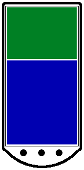

LayoutController
================

Replacement for the Fragments API

Maybe you have noticed but the APIs are not allways written for you. Sometimes you just need a little bit more. It is the same with Fragments. There are certain requirements that you need to follow in order to use them. If you don't want to follow those requirements you need to roll your own implementation which provides the same functionality which Fragments give you. Here is our implementation. 
 
Please have in mind that you can use the provided code, but it wasn't inteded as a complete API and replacement for Fragments. It just illustrates one way you can replace Fragments and can be extended or changed in many different ways depending on what your actual needs are. So please use it as is or use it as a starting point for your own implementation.

How to use Layout Controller
============================

In the repository there is a project providing an example on using the Layout Controller - TestLayoutController, directory.

Quick introduction of basic principles

You should use one ControllerManager instance for each view hierarchy you want to manage. Each ControllerManager needs a view placeholder (a parent view) that you place in your layout, to which childs will be added and removed (with push and pop mehtods). 
For instance in the device image the green and blue regions represent parent views. For each of them we should use a separate ControllerManager.
  
</img>
